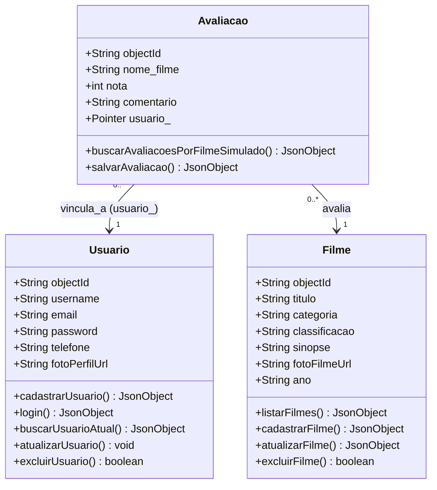

# BlockFilmes 🎬

O **BlockFilmes** é um sistema completo de catálogo e avaliação de filmes, desenvolvido como projeto acadêmico. O ecossistema é dividido em duas aplicações independentes que compartilham o mesmo banco de dados em nuvem.

---

## 👥 Estrutura do Projeto e Divisão da Equipe

O projeto foi unificado em um único repositório para demonstrar a integração entre plataformas:

* **Painel Desktop (JavaFX): É a área administrativa do sistema, permitindo o cadastro de novos filmes, gerenciamento de dados e monitoramento de todas as avaliações enviadas pelos usuários.
* **Portal Web (JavaScript/HTML/CSS):É a interface voltada ao cliente final, onde os usuários navegam pelo catálogo de filmes, visualizam detalhes e registram suas notas e comentários.

---

## 📊 Diagramas de Arquitetura (UML)

### 1. Diagrama de Casos de Uso (Fronteira do Sistema)
Este diagrama representa os limites do sistema (campo quadrado), as funcionalidades internas por plataforma e as interações do Usuário dependendo de qual ambiente ele está operando.

```mermaid
graph LR
    %% Atores na Esquerda (Estilo Caixa sem Boneco)
    subgraph Atores [Atores do Sistema]
        style Atores fill:none,stroke:none
        UserWeb["👤 Usuario Web<br>(Cliente / Navegador)"]
        UserDesk["💻 Usuario Desktop<br>(Gerencia / Java)"]
        UserBase["👤 Usuario Geral"]
    end

    %% Estilos dos Atores
    style UserWeb fill:#222,stroke:#fff,stroke-width:2px,color:#fff
    style UserDesk fill:#222,stroke:#fff,stroke-width:2px,color:#fff
    style UserBase fill:#333,stroke:#aaa,stroke-width:2px,color:#fff

    %% Herança entre os Atores (Igual à foto)
    UserWeb -->|Herda de| UserBase
    UserDesk -->|Herda de| UserBase

    %% Fronteira do Sistema (O Quadrado Escuro Central)
    subgraph Sistema_BlockFilmes [Sistema BlockFilmes]
        style Sistema_BlockFilmes fill:#111,stroke:#e50914,stroke-width:3px,color:#fff
        
        %% Coluna da Esquerda do Quadrado
        CU_EnviarAvaliacao([Enviar Avaliacao e Nota])
        CU_VisualizarDetalhes([Visualizar Detalhes do Filme])
        CU_CadastrarFilme([Cadastrar Filme])

        %% Coluna Central/Direita do Quadrado
        CU_Login([Fazer Login])
        CU_NavegarCatalogo([Navegar no Catalogo])
        CU_MonitorarAvaliacoes([Monitorar Avaliacoes])
        CU_ExcluirFilme([Excluir Filme])
        CU_AtualizarFilme([Atualizar Filme])
        CU_CriarConta([Criar Conta])
    end

    %% Relacionamentos de Include (Tracejados)
    CU_EnviarAvaliacao -.->|<<include>>| CU_Login
    CU_CadastrarFilme -.->|<<include>>| CU_Login

    %% Ligações dos Atores para os Casos de Uso
    UserWeb --> CU_EnviarAvaliacao
    UserWeb --> CU_VisualizarDetalhes
    UserWeb --> CU_NavegarCatalogo

    UserDesk --> CU_CadastrarFilme
    UserDesk --> CU_MonitorarAvaliacoes
    UserDesk --> CU_ExcluirFilme
    UserDesk --> CU_AtualizarFilme
    UserDesk --> CU_CriarConta
    UserDesk --> CU_Login

    %% Banco de Dados na Direita Extrema
    BD[("💾 Banco de Dados<br>BackEnd")]
    style BD fill:#1f1f1f,stroke:#007acc,stroke-width:2px

    %% Setas saindo dos Casos de Uso para o Banco de Dados
    CU_Login --> BD
    CU_EnviarAvaliacao --> BD
    CU_NavegarCatalogo -->|Consulta| BD
    CU_MonitorarAvaliacoes -->|Consulta| BD
    CU_ExcluirFilme --> BD
    CU_AtualizarFilme --> BD
    CU_CriarConta --> BD
```

2. Diagrama de Classes
Mapeamento lógico das entidades do sistema, demonstrando como o usuário terá funções e permissões diferentes dependendo da plataforma onde realizar o acesso (Web ou Desktop), integrando os dados através de Pointers nativos do banco de dados.

🚀 Tecnologias Utilizadas
Backend & Banco de Dados
Back4App (Parse API): Persistência de dados em nuvem, autenticação de usuários e relacionamentos através de Pointers.

Módulo Desktop (Java)
Java 17 / JavaFX 21

Maven (Gerenciamento de dependências)

Gson (Parseamento de JSON)

Módulo Web
HTML5 / CSS3 / JavaScript (ES6)

Fetch API (Integração com o Back4App)

📦 Como Executar os Projetos
1. Executando o Painel Desktop (Java)
Certifique-se de ter o JDK 17+ instalado.

Abra o projeto na sua IDE (NetBeans).

Aguarde o Maven baixar as dependências.

Execute o projeto pressionando F6 ou limpando e construindo antes.

2. Executando o Portal Web
Abra os arquivos da pasta Web em qualquer navegador moderno clicando duas vezes no arquivo index.html.
